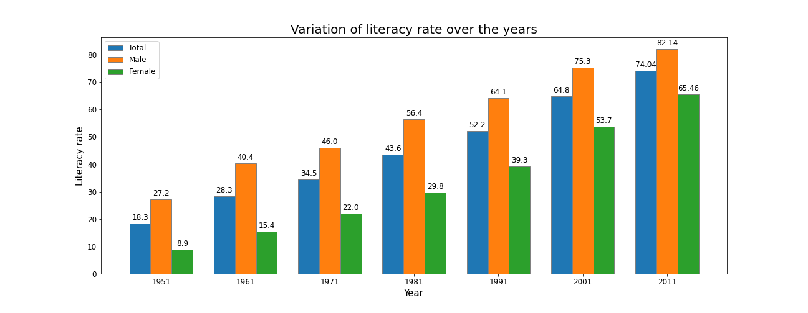
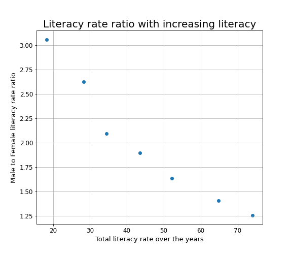
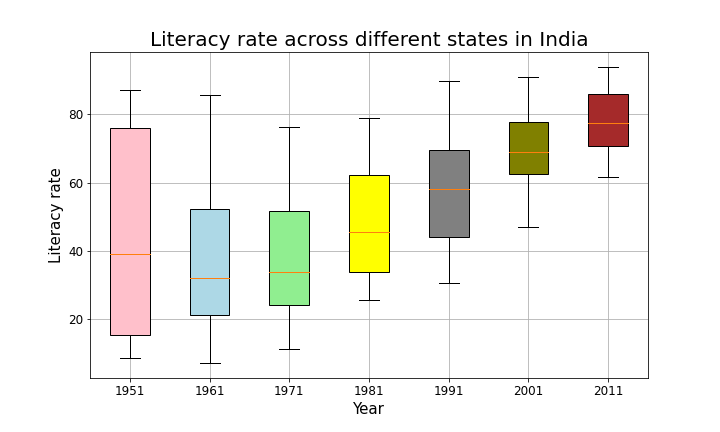

# DS200: Research Methods
## Module 4: Literature Review and Software Tooling

#### Datasets used:
State level Literacy rate in % from 1951-2011 and Gender based Literacy rate in % from 1951-2011 [1]
The python file (main.py) generates the plots from the datasets.

### 1. Bar Plot
  
	**Observation**:\
	From the above plot, we observe a continuous increase in literacy rate over the years for both the genders.
  Also, the gap between male and female literacy rate can be seen to be decreasing. For a developing country like India, 
  this plot shows a positive ray of hope towards achieving greater literacy rate with time.

### 2. Scatter Plot
  
	**Observation**:\
	From the above plot, we observe as the total literacy increases over the years, the ratio of male to female literacy rate decreases.
  There exists a negative linear correlation between total literacy and gender literacy variation. As more people are educated, 
  more females are encouraged to be literate. This helps in bridging the gap among gender literacies. This is a good sign indicating towards 
  removal of societal discrepancies over time.

### 3. Box Plot

  **Observation**:\
  From the above plot, we observe that the median literacy rate almost increases over years and there exists a reduction 
  in variance between literacy rate of all states. With increasing time, this trend is again promising to remove literacy variation over the country.

	
#### Sources:
[1] Datasets: https://data.gov.in/catalog/literacy-rate?filters%5Bfield_catalog_reference%5D=135639&format=json&offset=0&limit=6&sort%5Bcreated%5D=desc

[2] Matplotlib: Python plotting, Matplotlib.org, 2020.: https://matplotlib.org/
